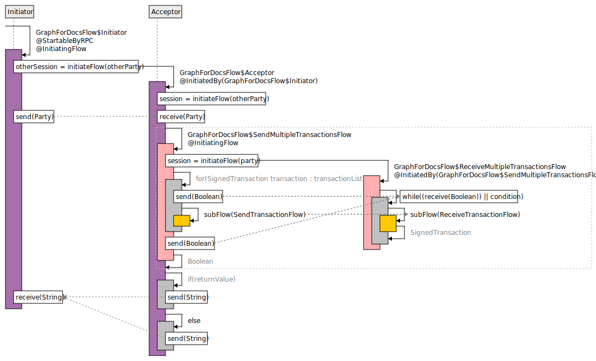

# Corda flows doc builder plugin

[](https://travis-ci.org/lucacampanella/corda-flows-doc-builder)
[](LICENSE)

Gradle plugin to automatically generate graph that represent Corda flows interactions. 
The plugin is intended to help developers automatically build documentation regarding the 
[Corda](https://www.corda.net/) flows they write. 

The graphs built by the plugin try to
closely follow the guidelines given by Corda on how to write such documentation. 
(See [Corda modelling notation](https://solutions.corda.net/corda-modelling-notation/views/views-flow-sequence.html))
The plugin works by decompiling the class files inside the flows jar, looking for
classes that represent flows and statically analyzing them for `send` and `receive` calls. Specifically
the plugin analyzes all the classes tagged with `@StartableByRPC` inside the jar.

With the information obtained from static analysis it builds the .svg images useful for documentation.
 They are then integrated into an ascii doc file giving a summary of the analysis of the Jar.

Since it works by decompiling code, it can be applied to flows written in Java, Kotlin or any other 
JVM-based language. For non-java generated bytecode it might be useful sometimes to switch decompilers, 
see configurable options for more details.

## Getting Started

The doc builder can be used in two ways:
- as a Gradle plugin
- as a standalone executable

### Installing

#### As a Gradle plugin

To apply the plugin, in the `build.gradle` 
(see [gradle website](https://plugins.gradle.org/plugin/com.github.lucacampanella.plugin.flows-doc-builder-plugin)):

Using legacy plugin application:

```
buildscript {
  repositories {
    maven {
      url "https://plugins.gradle.org/m2/"
    }
  }
  dependencies {
    classpath "com.github.lucacampanella:plugin:+"
  }
}

apply plugin: "com.github.lucacampanella.plugin.flows-doc-builder-plugin"
```

Be careful: in any case the plugin should be applied after the Java plugin or any other plugin that creates 
a Jar task. Otherwise the plugin won't find these tasks and won't analyze the corresponding Jars.

The tasks created by the plugin need a dependency, which is part of JCenter. 
Please include it in your project repositories:
```
repositories {
    jcenter()
}
```

#### As a standalone executable
Download latest version of the fat Jar (ends in `-all`) from the [Bintray repo](https://bintray.com/lucacampanella/mvn-release/graph-builder)
 (also uploaded on JCenter).


## Usage

### As a Gradle plugin

The plugin hooks itself into the tasks of type Jar, creating an analyze task for each Jar task. 
The tasks created have the format `<originalTaskName>AnalyzerTask`. For example the task that analyzes
the default Jar is called: `jarAnalyzerTask`. 

To analyze a jar just call his corresponding analyzer task. Example, to analyze the Jar output of the
`Jar` task use `./gradlew jarAnalyzerTask`

To see all the available analyzer tasks run: `./gradlew listFlowAnalysisTasks`

Since the plugin works by decompiling the class files inside the jar, it loses information such as
line numbers or comments. For this reason is possible to point the plugin also to the source files that
compiled constitute the jar. For this option see `filesPaths` in the Configurable options section.

By default the documentation graphs are put inside `build/reports/flowsdocbuilder` in .svg and .adoc format.

#### Configurable options
For each analyzer task you can configure various options:
- `outPath`: the path where the documentation files are placed. 
  * Example: `outPath = "myFavouriteFolder/docs"`
  * Default: `build/reports/flowsdocbuilder`  
- `logLevel`: the log level to use for logging inside the task. It should be one of the 
[slf4j log levels](https://www.slf4j.org/apidocs/org/slf4j/event/Level.html). The input is taken as string and
later in the task converted to the enum. Case insensitive.
  * Example: `logLevel = "TRACE"` or `logLevel = "debug"`
  * Default: defaults to gradle specified log level. For example run task with `--info`
option to obtain slf4j `DEBUG`. If the `logLevel` is specified by the user in the task
this always takes precedence over gradle specified log level.
- `removeJavaAgents`: decide whether you want the plugin to remove java agents from
the execution of the task. It's very common in Corda development environments to have
the Quasar plugin modify every `JavaExec` task to have as `jvmArg` of the task something like
`-javaagent:path/to/quasar.jar`. This just slows the analysis down and sometimes 
creates unrelated exceptions, thus is disabled by default, but user can decide
to leave the java agent by selecting `removeJavaAgents = false`.
  * Example: `removeJavaAgents = false`  
  * Default: `true`  
- `pathToExecJar`: change the jar executable used for the analysis. By default the
plugin relies on the analysis engine that can be found in this repo under the `graph-builder`
 submodule. The dependency is automatically fetched and exceuted by gradle when the plugin
 is applied. If the user wants to change this for any reason can use this option.  
  * Example: `pathToExecJar = "path/to/my/analyzerExtended.jar"`
  * Default: the latest version of the Jar is downloaded from the artifactory automatically Gradle dependency handler.
- `decompilerName`: change the decompiler used. Available options: `CFR`, `Fernflower`  
  * Example: `decompilerName = "fernflower"`  
  * Default: `CFR`
- `sourceFilesPath`: add more files to the analysis other than the jar file to which the 
task is hooked to. The option is a String array / list of string paths. Accepted inputs are `.jar`, `.java` or 
folders containing either of them. The
folders are analyzed recursively. The typical usage of this option is to add to the analysis the source 
files that produced the `jar`, so that information such as line numbers or comments are preserved. In fact
if the initiating classes have a top level comment, this is inserted in the ascii doc. The `sourceFilesPath` option
is particularly useful in combination with `analyzeOnlySourceFiles` and `drawLineNumbers`.  
  * Example: `sourceFilesPath = ['src/main/java']`  
  * Default: `[]`, empty list / array  
- `drawLineNumbers`: boolean option to draw line numbers left to the expression. If the files are decompiled
and not added with the option `sourceFilesPath`, the line numbers will correspond to the ones generated 
during decompilation.
  * Example: `drawLineNumbers = true`  
  * Default: `false`
- `analyzeOnlySourceFiles`: if some `.java` files are passed with the option `filePaths`, this option allows
to only analyze and output the documentation regarding these source files and omit all the other
classes tagged as `@StartableByRPC` that are found in the Jar.
  * Example: `analyzeOnlySourceFiles = true`  
  * Default: `false`
- `drawBoxes`: draw dashed boxes around each subflow, to better see division of labour between flows.
  * Example: `drawBoxes = false`  
  * Default: `true`

For example using the Groovy DSL:
```
jarAnalyzerTask {
    outPath = project.buildDir.path + "/reports/differentdir/flowsdocbuilder"
    logLevel = "TRACE"
    removeJavaAgents = false
    pathToExecJar = "path/to/my/analyzerExtended.jar"
    decompilerName = "fernflower"
    sourceFilesPath = ['src/main/java']
    drawLineNumbers = true
    analyzeOnlySourceFiles = true
    drawBoxes = false
}
```

A typical and useful setting is:
```
jarAnalyzerTask {
    sourceFilesPath = ['src/main/java']
    drawLineNumbers = true
    analyzeOnlySourceFiles = true
}
```

#### Tips
The plugin works best on fat / uber jars with all the dependencies inside. The best way to achieve such a jar
is to use the [shadow plugin](https://github.com/johnrengelman/shadow) to create the fat jar. Then run
`shadowJarAnalyzerTask` to create documentation based on this Jar.

#### Gradle minimum version
The plugin requires Gradle minimum version 4.10 in order to work.

### As a standalone executable
Run with:
```
java -jar [-Dorg.slf4j.simpleLogger.defaultLogLevel=<logLevel>] graph-builder-<version>-all.jar 
<path/to/input_jar.jar> \
[paths/to/sourceFilesFolder, paths/to/additionalSource/File.java, 
path/to/additionalClasspathJars.jar ...] \
[-o <path/to/output_folder>] \
[-d <decompilerName>]
[-l] [--no-box-subflows] [-s] [--no-arrows]
```
Meaning:
- `-Dorg.slf4j.simpleLogger.defaultLogLevel=<logLevel>`: optional parameter to decide the 
log level. Complete `<logLevel>` with one of the 
[slf4j log levels](https://www.slf4j.org/apidocs/org/slf4j/event/Level.html).
- `graph-builder-<version>-all.jar`: the analyzer executable 
- `<path/to/input_jar.jar>`: path to the jar to be analyzed. Other files can be added. 
Accepted inputs are `.jar`, `.java` or folders containing either of them. The
folders are analyzed recursively. The typical usage of this option is to add to the analysis the source 
files that produced the `jar`, so that information such as line numbers or comments are preserved. In fact
if the initiating classes have a top level comment, this is inserted in the ascii doc. The `sourceFilesPath` option
is particularly useful in combination with `--only-source-files` and `--draw-line-numbers`.  
Also useful when the Jar to be analyzed is not a fat Jar and the analysis still needs some dependencies.
- `-o <path/to/output_folder>`: the output folder where the resulting documentation should be placed.  
Default: `graphs`
- `-d <decompilerName>`: change the decompiler used. Available options: `CFR`, `Fernflower`  
Default: `CFR` 
- `-l`/`--draw-line-numbers`: boolean option to draw line numbers left to the expression. If the files are decompiled
and not added as `.java`, the line numbers will correspond to the ones generated 
during decompilation.  
Default: `false`
- `-s`/`--only-source-files`: if some `.java` files are passed, this option allows
to only analyze and output the documentation regarding these source files and omit all the other
classes tagged as `@StartableByRPC` that are found in Jar files.
- `--no-box-subflows`: don't draw dashed boxes around each subflow.


## Running the tests

After cloning the repo, run `./gradlew test`

## Example output
This is an example of how the produced .svg image looks like. The file is generated from the analysis of 
[GraphForDocsFlow.java](graph-builder/src/test/java/com/github/lucacampanella/callgraphflows/staticanalyzer/testclasses/GraphForDocsFlow.java)
 

## Built With

* [Gradle](https://gradle.org/) - Gradle build tool
* [Spoon](http://spoon.gforge.inria.fr/) - Static analysis and decompilation library
* [JFreeSVG](http://www.jfree.org/jfreesvg/) - Library to draw SVG files in java

## Contributing

Please read [CONTRIBUTING.md](CONTRIBUTING.md) for details on our code 
of conduct, and the process for submitting pull requests to us.

## Versioning

We use [Reckon Gradle Plugin](https://github.com/ajoberstar/reckon) for versioning. For the versions available, 
see the [tags on this repository](https://github.com/lucacampanella/corda-flows-doc-builder/tags). 

## Authors

* **Luca Campanella** - *Initial work* - [GitHub](https://github.com/lucacampanella)

<!-- See also the transactionList of [contributors](https://github.com/your/project/contributors) who participated in this project. -->

This project was developed for [AdNovum](https://www.adnovum.ch/) in the scope of the projects
[SB4B](https://www.adnovum.ch/en/company/media/media_releases/2018/adnovum_launches_secure_blockchain_for_business.html) 
and [Cardossier](https://www.adnovum.ch/en/innovation/blockchain_car_dossier.html).

## License

This project is licensed under the Apache 2.0 License - see the [LICENSE](LICENSE) file for details

## Acknowledgments
* Special and huge thanks goes to Michael von Känel for answering all my questions thoroughly and always with a smile
* Hat tip to anyone whose code was used

